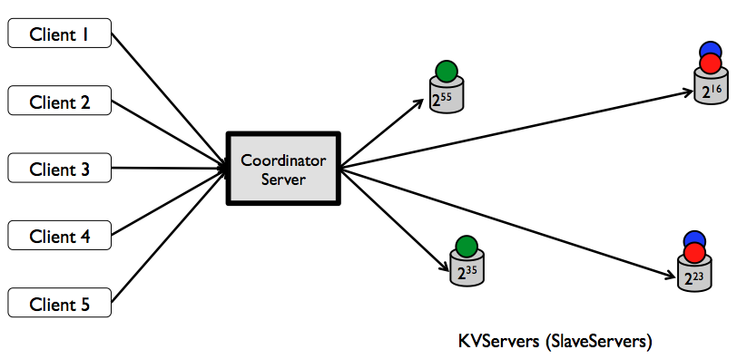
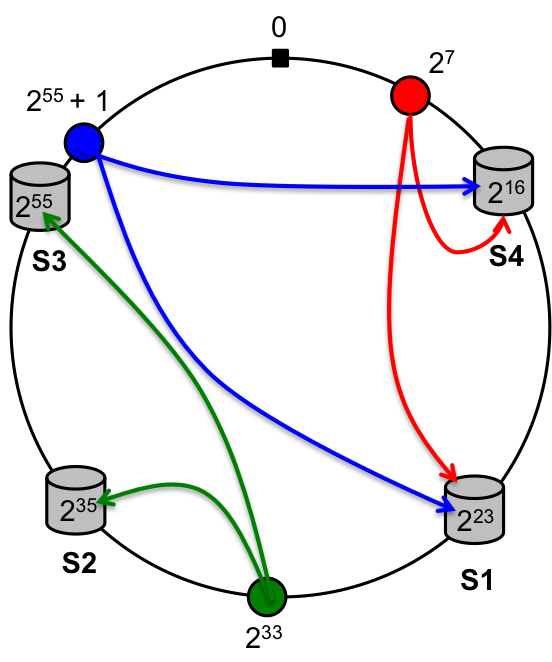

Distributed Key-value Store
===

* Data storage is durable, i.e.the system doesn't lose data if a single node fails.Replication is used for fault tolerance(here replication factor=2).
* Multiple clients will be communicating with a single coordinating server (Master) in a JSON based message format and send the data through sockets using TCP channel.
* Operations on store key_value pair are atomic.Two-Phase Commit protocol is implemented to ensure atomic operations.
 

Consistent Hashing
====
key-value servers will have unique 64-bit IDs. The coordinator will hash the keys to 64-bit address space. Then each key-value server will store the first copies of keys with hash values greater than the ID of its immediate predecessor up to its own ID. Note that, each key-value server will also store the keys whose first copies are stored in its predecessor
                                   
   
Assumption
=====
* Coordinate Server will never fails
* For simplicity,we assume that the total number of key-value servers are fixed, at any moment there will be at most one down server, and they always come back with the same ID if they crash.
